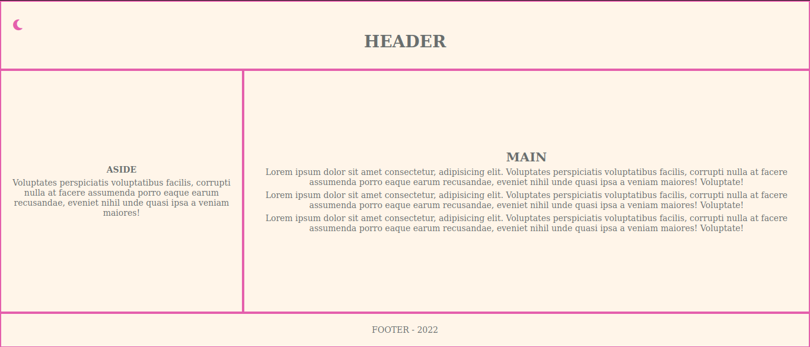
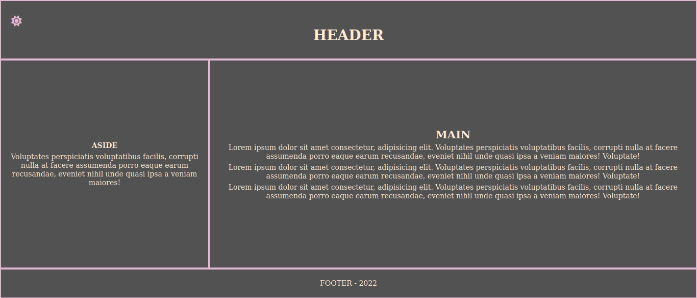

# Troca de tema

Este projeto apresenta uma página que realiza a transição de tema claro para tema escuro. JavaScript puro é utilizado em conjunto com a biblioteca Redux para o gerenciamento de estado da aplicação.

##  :gear: Tecnologias

- HTML
- CSS
- JavaScript
- Redux

##  :art: Layout

